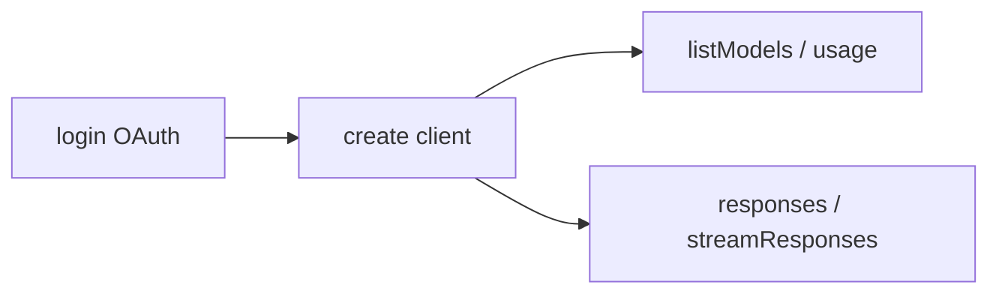

# codex-openai-api

<p align="center">
  Librería TypeScript standalone para usar <strong>Codex OAuth</strong> y <strong>Gemini OAuth</strong>
  con cliente HTTP o backend CLI local, sin servidor proxy intermedio.
</p>

<p align="center">
  =22" src="https://img.shields.io/badge/node-%3E%3D22-339933?logo=node.js&logoColor=white">
  
  
  
  
</p>

---

## Tabla de contenido

- [¿Qué incluye?](#qué-incluye)
- [Instalación](#instalación)
- [Build y tests](#build-y-tests)
- [Flujo recomendado](#flujo-recomendado)
- [Quick start Codex](#quick-start-codex)
- [Quick start Gemini](#quick-start-gemini)
- [Backends y capacidades](#backends-y-capacidades)
- [Uso con tools y web_search](#uso-con-tools-y-web_search)
- [Rutas personalizadas para auth/session files](#rutas-personalizadas-para-authsession-files)
- [API pública](#api-pública)
- [Variables de entorno](#variables-de-entorno)
- [Migración desde el enfoque anterior](#migración-desde-el-enfoque-anterior)
- [Notas](#notas)

---

## ¿Qué incluye?

La superficie pública está enfocada en cuatro piezas:

- `createCodexAuth`: login OAuth, persistencia local y refresh
- `createCodexClient`: acceso Codex por HTTP OAuth o `codex` CLI local
- `createGeminiAuth`: login OAuth web para Gemini, persistencia local y refresh
- `createGeminiClient`: acceso Gemini por HTTP OAuth o `gemini` CLI local

Contratos operativos principales:

- `codex-auth.json`
- `codex-sessions.json`
- `gemini-auth.json`
- `gemini-sessions.json`

---

## Instalación

```bash
npm install
```

---

## Build y tests

```bash
npm run build
npm run test
```

El build genera `dist/` con JS ESM, `d.ts` y sourcemaps.

---

## Flujo recomendado



1. Crear o cargar `codex-auth.json` o `gemini-auth.json`
2. Construir el cliente con `createCodexClient` o `createGeminiClient`
3. Llamar `usage`, `listModels` o `responses`

Si no pasas `authFile` ni defines variables de entorno, la librería usa:

- `./codex-auth.json`
- `./codex-sessions.json`
- `./gemini-auth.json`
- `./gemini-sessions.json`

---

## Quick start Codex

```ts
import { createCodexAuth, createCodexClient } from "codex-openai-api";

const auth = createCodexAuth();
await auth.login();

const client = createCodexClient({
  auth,
  defaultInstructions: "Reply in one short sentence.",
});

const catalog = await client.listModels({ source: "auto" });
console.log(catalog.models.map((model) => model.id));

const result = await client.responses({
  model: "gpt-5.4",
  input: "hola",
});

console.log(result.outputText);
```

Backend CLI local:

```ts
const cliResult = await client.responses({
  backend: "cli",
  model: "gpt-5.4",
  sessionId: "my-chat",
  input: "Resume the last answer in Spanish.",
});
```

Notas prácticas Codex:

- `usage()` y `listModels()` usan backend HTTP OAuth
- `cli` sólo afecta `responses()` y `streamResponses()`
- `tools`, `toolChoice` e `includeEvents` no están soportados en backend `cli` v1
- backend `cli` usa login nativo del binario `codex` (no `codex-auth.json`)

---

## Quick start Gemini

```ts
import { createGeminiAuth, createGeminiClient } from "codex-openai-api";

const auth = createGeminiAuth();
await auth.login();

const client = createGeminiClient({
  auth,
  defaultBackend: "http",
  defaultInstructions: "Reply in one short paragraph.",
});

const catalog = await client.listModels({ source: "auto" });
console.log(catalog.models.map((model) => model.id));

const usage = await client.usage();
console.log(usage.windows);

const result = await client.responses({
  model: "flash",
  tools: [{ type: "web_search" }],
  input: "What happened today in AI?",
  includeEvents: true,
});

console.log(result.outputText);
console.log(result.events);
```

Backend CLI local:

```ts
const cliResult = await client.responses({
  backend: "cli",
  model: "pro",
  sessionId: "my-chat",
  input: "Resume the last answer in Spanish.",
});
```

Notas prácticas Gemini:

- `listModels()` es estático en v1
- aliases como `pro`, `flash`, `flash-lite` se normalizan internamente
- `usage()` separa cuotas agregadas en ventanas como `Pro` y `Flash`

---

## Backends y capacidades

### Codex

| Capability | `http` | `cli` |
| --- | --- | --- |
| Auth | OAuth en `codex-auth.json` | login nativo de `codex` (`~/.codex` / Keychain) |
| Responses | Sí | Sí |
| `web_search` / tools | Sí | No |
| `includeEvents` | Sí | No |
| Persistencia de sesión | No | Sí (`codex-sessions.json`) |
| `usage()` / `listModels()` | Sí | No |

El backend `cli` es text-first: en fresh runs parsea JSONL para capturar `thread_id`; en resume runs trata stdout como texto plano y reutiliza `sessionId` lógico persistido.

### Gemini

| Capability | `http` | `cli` |
| --- | --- | --- |
| Auth | OAuth web en `gemini-auth.json` | usa mismo OAuth y ejecuta `gemini` local |
| Responses | Sí | Sí |
| `web_search` | Sí | No |
| `includeEvents` | Sí | No |
| Persistencia de sesión | No | Sí (`gemini-sessions.json`) |
| Catálogo de modelos | Estático en v1 | Estático en v1 |

El backend `http` traduce `tools: [{ type: "web_search" }]` a la herramienta nativa de Gemini. En v1, cualquier otra herramienta se rechaza explícitamente.

El backend `cli` es text-first: devuelve `outputText`, estado básico y reutiliza sesiones locales cuando envías el mismo `sessionId`.

---

## Uso con `tools` y `web_search`

`responses()` y `streamResponses()` aceptan herramientas upstream de forma genérica:

- `tools`: lista de herramientas que el modelo puede usar
- `toolChoice`: controla si el modelo decide automáticamente o si debe usar una herramienta

La librería reenvía estos campos al upstream de Codex sin transformarlos, salvo `toolChoice` que se serializa como `tool_choice` para el request HTTP.

```ts
const result = await client.responses({
  model: "gpt-5.4",
  input: "Resuelve esto usando herramientas si hace falta",
  tools: [{ type: "web_search" }],
  toolChoice: "auto",
});
```

Valores comunes de `toolChoice`:

- `"auto"`: el modelo decide
- `"required"`: obliga a usar herramienta
- `"none"`: desactiva herramientas en esa llamada

`web_search` no se activa por elegir `gpt-5.4` solamente: debes enviar `tools` en el payload.

```ts
const result = await client.responses({
  model: "gpt-5.4",
  tools: [{ type: "web_search" }],
  input: "What happened today in AI?",
  includeEvents: true,
});

console.log(result.outputText);
console.log(result.events);
```

Qué esperar de este flujo:

- `outputText` trae la respuesta final en texto plano
- `includeEvents: true` agrega `events` para inspeccionar stream SSE
- cuando `web_search` corre, pueden aparecer eventos como:
  - `response.web_search_call.in_progress`
  - `response.web_search_call.searching`
  - `response.web_search_call.completed`
- citas y metadata pueden venir en texto o en eventos (no se normalizan todavía)

---

## Rutas personalizadas para auth/session files

Codex:

```ts
import { createCodexAuth, createCodexClient } from "codex-openai-api";

const auth = createCodexAuth({
  authFile: "/absolute/path/to/codex-auth.json",
});

const client = createCodexClient({
  auth,
  sessionFile: "/absolute/path/to/codex-sessions.json",
  cliCommand: "/absolute/path/to/codex",
});
```

También puedes usar:

```bash
export CODEX_AUTH_FILE=/absolute/path/to/codex-auth.json
```

Gemini:

```ts
import { createGeminiAuth, createGeminiClient } from "codex-openai-api";

const auth = createGeminiAuth({
  authFile: "/absolute/path/to/gemini-auth.json",
});

const client = createGeminiClient({
  auth,
  sessionFile: "/absolute/path/to/gemini-sessions.json",
  cliCommand: "/absolute/path/to/gemini",
});
```

---

## API pública

### `createCodexAuth`

Expone:

- `authFile`
- `loadCredential()`
- `saveCredential()`
- `login()`
- `getFreshCredential()`

`login()` sigue siendo el mecanismo oficial para obtener o regenerar `codex-auth.json`.

### `createGeminiAuth`

Expone:

- `authFile`
- `loadCredential()`
- `saveCredential()`
- `login()`
- `getFreshCredential()`

`login()` abre OAuth web con callback en `http://localhost:8085/oauth2callback`. Si falla, cae a entrada manual del redirect URL o authorization code.

### `createCodexClient`

Expone:

- `usage()`
- `listModels({ source })`
- `responses({ input, model, instructions, backend, sessionId, tools, toolChoice })`
- `streamResponses({ input, model, instructions, backend, sessionId, tools, toolChoice })`

`backend` soporta:

- `"http"`: Codex HTTP con OAuth y SSE
- `"cli"`: subprocess local `codex` con persistencia de sesiones

`listModels({ source: "auto" })` intenta catálogo live con credencial válida y cae a catálogo estático cuando no.

`responses()` devuelve:

- `status`
- `outputText`
- `responseState`
- `events` (cuando usas `includeEvents: true`)
- `body` (cuando upstream responde con error serializable)

### `createGeminiClient`

Expone:

- `usage()`
- `listModels({ source })`
- `responses({ input, model, instructions, backend, sessionId, tools, toolChoice })`
- `streamResponses({ input, model, instructions, backend, sessionId, tools, toolChoice })`

`backend` soporta:

- `"http"`: Gemini HTTP con OAuth y SSE
- `"cli"`: subprocess local `gemini` con persistencia de sesiones

`responses()` devuelve:

- `status`
- `outputText`
- `responseState`
- `events` (cuando usas `includeEvents: true` en backend `http`)
- `body` (cuando upstream o CLI devuelven error serializable)

---

## Variables de entorno

- `CODEX_AUTH_FILE`: ruta del archivo OAuth Codex
- `CODEX_SESSION_FILE`: ruta del archivo de sesiones CLI de Codex
- `CODEX_MODEL`: modelo por defecto para requests upstream
- `CODEX_RESPONSES_URL`: endpoint upstream de Codex Responses
- `CODEX_INSTRUCTIONS`: instrucciones por defecto
- `CODEX_CLIENT_VERSION`: `client_version` para catálogo live
- `CODEX_CLI_PATH`: ruta del binario `codex`
- `GEMINI_AUTH_FILE`: ruta del archivo OAuth Gemini
- `GEMINI_SESSION_FILE`: ruta del archivo de sesiones CLI Gemini
- `GEMINI_MODEL`: modelo Gemini por defecto
- `GEMINI_INSTRUCTIONS`: instrucciones Gemini por defecto
- `GEMINI_RESPONSES_BASE_URL`: base URL del backend HTTP Gemini
- `GEMINI_CLI_PATH`: ruta del binario `gemini`
- `GEMINI_CLI_OAUTH_CLIENT_ID`: client id OAuth preferido para Gemini
- `GEMINI_CLI_OAUTH_CLIENT_SECRET`: client secret OAuth preferido para Gemini
- `OPENCLAW_GEMINI_OAUTH_CLIENT_ID`: alias compatible con OpenClaw
- `OPENCLAW_GEMINI_OAUTH_CLIENT_SECRET`: alias compatible con OpenClaw

---

## Migración desde el enfoque anterior

Este release elimina intencionalmente:

- el CLI `codex-openai-api`
- el servidor HTTP local
- la superficie OpenAI-compatible del proxy

Migración esperada:

- reemplazar `serve`
- reemplazar `curl http://127.0.0.1:8787/...`
- reemplazar `createCodexServer(...)`
- usar directamente `createCodexAuth()` y `createCodexClient()`

---

## Notas

- Usa bearer OAuth de Codex, no `OPENAI_API_KEY`.
- `responses()` trabaja directo contra upstream de Codex (sin capa HTTP local intermedia).
- Backend CLI de Codex requiere `codex` instalado y autenticado localmente.
- Integración Gemini usa OAuth web y endpoints observados en tooling existente; no es SDK oficial de Google para producción endurecida.
- Backend CLI de Gemini requiere `gemini` instalado y accesible por `PATH` o `GEMINI_CLI_PATH`.
